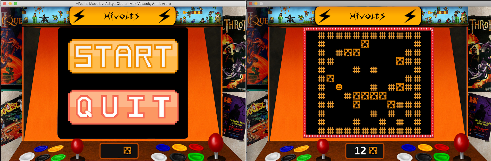

# HiVolt

Collaborators: Aditya Oberai, Max Valasek, Amrit Arora

Introduction:
This project is to replicate a game called HiVolts given the rules and principles on which the game operates. http://paleyontology.com/AP_CS/hivolts/
The main goal is to escape the evil Mhos trying to kill you, while also avoiding electric fences which, if touched, will electrocute you. We made 8 classes that allow you to play Hivolts as the specifications detail it.

For your reference:
Main initializes objects for the start of the game        

Music class handles the musical interface and respective methods to interface with the music.

Player class deals with player movement functions, player position, and player victory or death sequences.

Mho class stores the mho movement algorithm as well as a grouping of all mho coordinates as ArrayList.

KeyDetector uses keyboard input and respectively calls movement methods in Mho and Player classes

Cell class stores method that checks whether mho and player object states(ie. Checks death) and inputs values to each sub-class of type cell when game is started (Game Board Population)

HomeScreen stores all of the methods that initialize the home arcade screen with button listener and graphical layout

Painter runs all of the painting methods in specific order that are stored in GameBoard class and handles all game Frame functions such as array to window graphictization and animation sequences.

Fulfillment:

This fulfills the specification in that the game is playable and follows all of the guidelines and specifications provided. We have no current errors.

Board population: ✔ We have an electric fence border, and 20 fences and 12 Mhos randomly generated as a collection of points that are all unique points.

Player Death: ✔ In our program, the player dies if they come into contact with a fence or a Mho.

Player Movement:

10 different movement possibilities: ✔

Mho Movement:

Direct direction movement: ✔

Diagonal movement: ✔

Offset Horizontal Movement: ✔

Offset Vertical Movement: ✔

Move to electric fence when no other option: ✔

Stay(do nothing) when two mhos moving to the same position: ✔

Some extra components:
An integral part of this project was getting our HiVolts game to be unique with a beautiful graphical interface. We did everything we could to make the game look professional with a game that would interest the user to play more of the game. Some of the important extra features that we added are:

An arcade theme with music

Path drawing between player movement(parabola drawn)
   -  Takes initial and current player point and a vertex made through their average and a few intermediate calculation with the help of Panel2D java libraries to draw parabola. Made to tell user where your previous position is and adds a nice graphical touch.

Fading of the game board and individual components(Player, Mhos, Fences) respective to game state(win, loss, or currently playing)
Changed alpha of images using BufferedImages alpha change method.

These are just a few of our many animation sequences.

Current Errors:
 Link to test cases: https://docs.google.com/document/d/19Yy6jZXxGfy6Ga65E1QFWiFT1M0F4jeAV48C1okx6H4/edit

Overview of Code:

The main abstracted high-level pseudocode version of the base game without special features are as follows:
Wait for start game to be pressed and start musical features
		Loop: 
- Keyboard input is taken from KeyListener
- The player is then moved accordingly
- Mhos take the player position and run movement algorithm
- Check victory or loss and if either true, run respective game state sequence and exit game
- The board is drawn by converting array coordinates to window points by fine-tuning scaling constants (ex. Coordinate Point(x: 1,y: 1) - > Window Point(x: 260, 300))

The GUI is arcade game themed.
Challenges
One of our major problems was we could not figure out how to make the start screen disappear and transition into the game screen when a button was pressed and the next step to that was making it such that you can restart code without redeploying every time. After spending numerous hours isolating the problem, we got the button to work with the problem that the game would stop working periodically. While we could not solve the problem of not requiring redeploying of the code to play the game again given our time constraints, we will assuredly work toward the solution and push the new code to git when it works.
The player movement was tough because our code was unorganized at first. We had messy code, with duplicate methods, variables, function calls, and class instances in multiple files where they were not supposed to be. We tried to juggle multiple methods of storing points of objects in different ways as we did not create a robust algorithm before hand and jumped in to the code instead. This hindered our progress in implementing player movement. After hours of looking over code, line by line, we found that the problem was that we were creating a new instance of the now deleted GameBoard class, which also had the populateBoard method. From this we can learn that before you start coding you need a bullet proof solution and our code should always be optimized while programming, not afterwards.
The start button was really hard to make. It took us a really long time to make the program reliably launch into the game after pressing start. Our first problem was learning how JFrame, JLabel, Jbutton, and JFrame layouts work. We spent around a dozen hours studying these and were finally able to make the buttons display and function. Our next issue was making the button actually start the game. This part was especially hard because we couldn’t figure out how to make the paint function run on the current JFrame. After around 6 more hours, our new method was to dispose of the current JFrame and create a new one that deals with the game. This functioned, however, it created hundreds of frames in the background. Our solution to this issue was to create a class that creates global objects for each class. I did this because every time I restarted the frame, it created many many more as well. We still weren’t able to make the start button work more than once, however, because the key listener was being deleted with the frame, with a few more hours of work, I’m sure we could figure this out.

Acknowledgments:

We would like to acknowledge the assistance and/or information rendered by the following resources and people:

Java JFrame Documentation:
“Class JFrame.” JFrame (Java Platform SE 7 ), Oracle, 6 Oct. 2018, docs.oracle.com/javase/7/docs/api/javax/swing/JFrame.html.
Java KeyListener Documentation:
“KeyListener (Java Platform SE 7).” KeyListener (Java Platform SE 7 ), Oracle, 6 Oct. 2018, docs.oracle.com/javase/7/docs/api/java/awt/event/KeyListener.html.

Java KeyListener Example:
“How to Write a Key Listener.” How to Write a Key Listener (The Java™ Tutorials > Creating a GUI With JFC/Swing > Writing Event Listeners), Oracle, docs.oracle.com/javase/tutorial/uiswing/events/keylistener.html.

Java Sound Sample API:

“Package Javax.sound.sampled.” Javax.sound.sampled (Java Platform SE 7 ), 6 Oct. 2018,docs.oracle.com/javase/7/docs/api/javax/sound/sampled/package-summary.html.

HiVolt’s Rules
“HiVolt's Rules.” Paleyontology, paleyontology.com/AP_CS/hivolts/.

